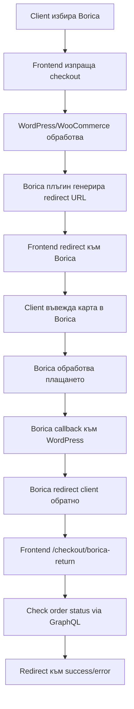

# Borica Headless Integration - Резюме

## 🎯 Какво беше направено

### 1. **Frontend Changes**

- ✅ Добавена икона за Borica в `PaymentOptions.vue`
- ✅ Добавена логика за Borica redirect в `useCheckout.ts`
- ✅ Създаден специализиран `useBorica.ts` composable
- ✅ Създадена `/checkout/borica-return` страница за обработка на callbacks
- ✅ Добавен error handling за Borica грешки

### 2. **Ключови файлове**

```
woonuxt_base/app/components/shopElements/PaymentOptions.vue  # Borica икона
woonuxt_base/app/composables/useCheckout.ts                  # Checkout логика
composables/useBorica.ts                                     # Borica composable
pages/checkout/borica-return.vue                             # Return handler
BORICA_SETUP_GUIDE.md                                        # Setup инструкции
BORICA_TESTING_GUIDE.md                                      # Testing инструкции
```

### 3. **Как работи интеграцията**



## 🔧 Следващи стъпки

### Задължителни за тестване:

1. **Инсталирай Borica плъгина** в WordPress backend
2. **Конфигурирай тестовите настройки** според `BORICA_SETUP_GUIDE.md`
3. **Тествай с тестови карти** според `BORICA_TESTING_GUIDE.md`
4. **Провери всички сценарии** - успешно, неуспешно, прекъснато плащане

### За Production:

1. **Получи production сертификати** от банката
2. **Конфигурирай production настройки**
3. **Тествай с реални малки суми**
4. **Настрой мониторинг** за грешки

## 🚨 Важни забележки

### Специфики за Headless:

- **Borica плъгинът работи стандартно** в WordPress backend
- **GraphQL API автоматично експозва** Borica като payment gateway
- **Frontend обработва redirect-ите** чрез специализирани страници
- **Return URL-ите трябва да са правилно конфигурирани**

### Security:

- **SSL сертификат е задължителен**
- **Сертификатите от банката са критични**
- **Callback signature validation** се прави от плъгина
- **Sensitive данни не се пращат към frontend**

### Performance:

- **Redirect към Borica е мигновен**
- **Return обработката проверява статус чрез GraphQL**
- **Timeout-и са конфигурирани за бавни мрежи**

## 📞 Support

При проблеми провери:

1. **WordPress error logs** `/wp-content/debug.log`
2. **Borica plugin logs** `/wp-content/uploads/wc-logs/`
3. **Browser console** за frontend грешки
4. **Network tab** за GraphQL заявки

За допълнителна помощ:

- VanboDevelops документация: https://docs.vanbodevelops.com/borica-emv-for-woocommerce/
- WooNuxt документация за payment gateways
