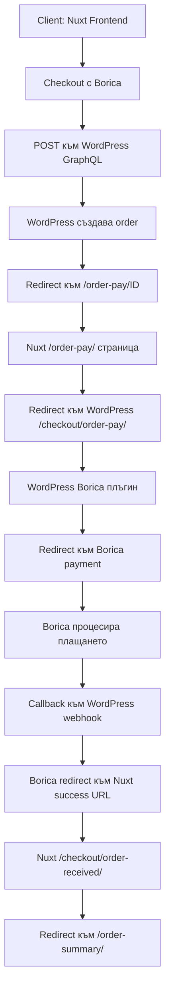

# Borica URL Configuration за Headless Setup

## 🎯 Проблемът с URL-тата

WordPress и Nuxt frontend имат различни URL структури:

- **WordPress backend:** `https://leaderfitness.admin-panels.com/`
- **Nuxt frontend:** `https://woonuxt-ten.vercel.app/`

## ✅ Създадените страници в Nuxt:

```
/order-pay/[orderId].vue                    # Основна обработка
/porachka-2/order-pay/[orderId].vue         # Българска локализация
/checkout/order-pay/[orderId].vue           # WordPress очаква този път
/checkout/order-received/[orderId].vue      # За връщане след плащане
```

## ⚙️ WordPress Borica настройки

### 1. Отиди на WordPress Admin:

```
https://leaderfitness.admin-panels.com/wp-admin/
↓
WooCommerce > Настройки > Плащания > Борика EMV
```

### 2. Return URLs секция:

Конфигурирай следните URLs за да пренасочват към Nuxt frontend-а:

#### ✅ Success Return URL:

```
https://woonuxt-ten.vercel.app/checkout/order-received/
```

#### ✅ Failure Return URL:

```
https://woonuxt-ten.vercel.app/checkout?payment_error=borica
```

#### ✅ Cancel Return URL:

```
https://woonuxt-ten.vercel.app/checkout?payment_error=borica_cancelled
```

### 3. Notification URLs (ако има такава опция):

#### ✅ IPN/Webhook URL:

```
https://leaderfitness.admin-panels.com/wp-json/wc/v1/payment_gateways/borica_emv/callback
```

(Това остава към WordPress за обработка на callback-ите)

## 🔄 Payment Flow:



## 🧪 Debug стъпки:

### 1. Провери browser console:

```javascript
// Трябва да видиш тези logs:
Order-pay параметри: {orderId: "99637", orderKey: "...", paymentMethod: "borica_emv"}
Runtime config: {GQL_HOST: "https://leaderfitness.admin-panels.com/graphql", baseUrl: "..."}
Пренасочване към WordPress: https://leaderfitness.admin-panels.com/checkout/order-pay/99637/...
```

### 2. Провери Network tab:

- Заявка към WordPress order-pay
- Redirect към Borica
- Return back към Nuxt

### 3. Тествай с малка сума:

- Направи тестова поръчка
- Проследи всеки redirect
- Провери дали се връщаш правилно

## 🚨 Често срещани проблеми:

### Проблем: 404 на /checkout/order-pay/

**Решение:** Качи новите страници в Nuxt

### Проблем: Безкрайни redirects

**Решение:** Провери return URLs в Borica настройки

### Проблем: Borica не приема домейна

**Решение:** Добави домейна в Borica merchant настройки

### Проблем: SSL грешки

**Решение:** Провери дали frontend-ът има валиден SSL

## 📋 Checklist за производство:

- [ ] WordPress Borica плъгин активиран и конфигуриран
- [ ] Return URLs настроени към frontend домейна
- [ ] SSL сертификати валидни на двата домейна
- [ ] Тестово плащане работи end-to-end
- [ ] Production сертификати заредени в Borica
- [ ] Monitoring настроен за грешки

## 💡 Полезни команди:

```bash
# Тестване на URLs
curl -I https://woonuxt-ten.vercel.app/checkout/order-pay/99637
curl -I https://leaderfitness.admin-panels.com/checkout/order-pay/99637

# Проверка на SSL
openssl s_client -connect woonuxt-ten.vercel.app:443
```
